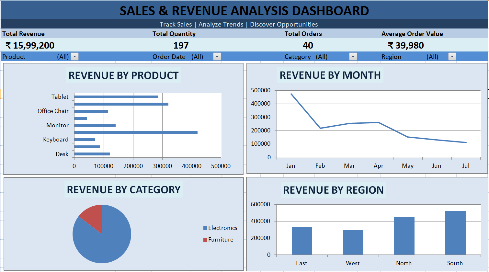

# 📊 Sales & Revenue Analysis Dashboard

An Excel-based interactive dashboard designed to analyze sales performance, revenue trends, product performance, categories, and regional sales.

## 📸 Dashboard Preview

## 🛠️ Tools & Technologies

- Microsoft Excel
- PivotTables
- PivotCharts
- Excel Dashboard
- Data Visualization
- Data Analysis

## 📈 Key Performance Indicators

| KPI | Value |
|---|---:|
| 💰 Total Revenue | ₹15,99,200 |
| 📦 Total Quantity | 197 |
| 🧾 Total Orders | 40 |
| 💵 Average Order Value | ₹39,980 |

## 📊 Dashboard Features

- Revenue by Product
- Monthly Revenue Trend
- Revenue by Category
- Revenue by Region
- Interactive filters
- KPI tracking
- Sales performance analysis

## 🎯 Project Objective

The objective of this project is to analyze sales and revenue data and transform it into a clear, interactive dashboard that helps identify sales trends, top-performing products, category performance, and regional opportunities.

## 💡 Key Insights

- **South** region generated the highest revenue.
- **Laptop** was the highest-revenue product.
- **Electronics** contributed the majority of total revenue.
- Revenue was highest in **January**.
- The dashboard allows sales performance to be analyzed using different filters.

## 📁 Project Files

- `Sales_Revenue_Analysis_Dashboard.xlsx` — Complete Excel dashboard
- `dashboard_preview.png` — Dashboard preview

## 🚀 How to Use

1. Download the Excel workbook.
2. Open it using Microsoft Excel.
3. Go to the **Dashboard** sheet.
4. Use the available filters to analyze sales performance.
5. Explore the PivotCharts and KPIs.

## 👤 Author

**Prithyanga S**
